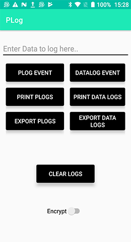
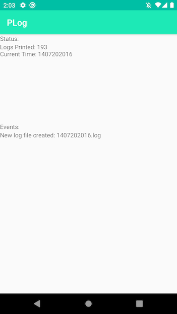
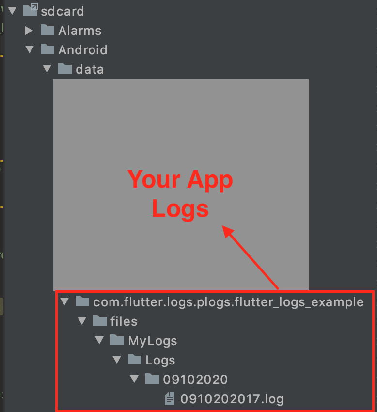

# RxLogs Advanced Logging
[]( https://android-arsenal.com/details/1/6633 )
### PLog and DataLog (Loggers)
##### `A file based advanced logging framework written in Kotlin`.

[](https://jitpack.io/#umair13adil/RxLogs)

Overview
--------

PLogs provides quick & simple file logging solution. All logs are saved to files in storage path provided. These logs are helpful when developer wants to analyze user activities within the app. A new log file is created every hour on a user event. These logs can be filtered and sorted easily. Logs can easily be exported as zip file base on filter type. This zip file can be uploaded to server on export. PLogs also provide functionality to arrange data logs into a predefined directory structure. These logs can be used for a specific events within the app. Logs can be saved as encrypted data.





##### Read more about RxLogs usage on this Medium article: 

[Sending logs from apps in real-time using ELK stack & MQTT](https://itnext.io/sending-logs-from-flutter-apps-in-real-time-using-elk-stack-mqtt-c24fa0cb9802)

Features
--------

1. Logs events in files created separately every hour with **'PLogs'** logger. (24 hours)
2. Files can be compressed and exported for time and day filters
3. Clear Logs easily
4. Save logs to app's storage path
5. Export Logs to custom path as zip file
6. RxJava2 support
7. Custom Log formatting
8. CSV support
9. Custom timestamps support
10. Custom data logging support with **'DataLogs'** logger.
11. Encryption support added
12. Auto Log system crashes
13. Multiple directory structures
14. Print logs as String
15. Export all or single types of logs
16. XML configuration support for internal persistence
17. Logger events Subscription
18. Advanced Automation for deleting logs automatically
19. Exports HTML formatted exceptions
20. ELK Stack Supported See more about it [here](https://www.elastic.co/what-is/elk-stack).
21. MQTT Support
22. Added logs queueing for offline support (MQTT Feature)
23. Backpressure-aware ingestion — sheds low-priority levels under load, with per-level quotas
24. Field-level redaction — `@Sensitive` annotation and regex rules auto-mask PII before writing

Setup
-------------

Add module to your project:

## Step 1. Add the JitPack repository to your build file

Add it in your root build.gradle at the end of repositories:
```groovy
    allprojects {
    repositories {
        maven { url 'https://jitpack.io' }
    }
}
```
## Step 2. Add the dependency

```groovy
    dependencies {
    implementation 'com.github.umair13adil:RxLogs:[Latest_Version]'
    }
```
    
Usage
-------------

Add following implementation in your Application class.

```kotlin
class MainApplication : Application() {
    
        override fun onCreate() {
            super.onCreate()
    
            setUpPLogger() //Initialize PLogger here
        }

private fun setUpPLogger() {
             val logsPath = "PLogs"
             
                     val logsConfig = LogsConfig(
                             isDebuggable = true,
                             savePath = logsPath,
                             zipFileName = "MyLogs",
                             exportPath = logsPath + File.separator + "PLogsOutput"
                     )

                     PLog.applyConfigurations(logsConfig, saveToFile = true, context = context) //Initialize configurations
                   
         }
}
```

#### Logs retention and auto-clear
_______________________________________________

- When `autoClearLogs = true` and `logsRetentionPeriodInDays = x`, only logs older than (today - x days) are deleted.
- Recent logs (from the last x days including today) are preserved.
- On first run (no previous clear date), the same selective cleanup is applied.

Programmatic helper to apply retention immediately:

```kotlin
// Deletes only logs older than the cutoff. Keeps recent logs.
PLog.clearLogsOlderThan(x)
```

Notes:
- Works with `DirectoryStructure.FOR_DATE`, `FOR_EVENT`, and `SINGLE_FILE_FOR_DAY` using `ddMMyyyy` day prefixes.
- `autoClearLogs` must be true for automatic cleanup triggered by the library.

#### Where are my logs stored?
_______________________________________________
 
 Your logs can be found in the path of your app's directory in storage:
 
*--> Android/data/[YOUR_APP_PACKAGE]/files/[YOUR_LOGS_FOLDER_NAME]/Logs/*
 
 

#### To Log data to file simply call like this
_______________________________________________

**1. Simple Info Log**

```kotlin
    PLog.logThis(TAG, "method_name", "Log: " + Math.random(), LogLevel.INFO)
```

**2. Simple Warning Log**

```kotlin
    PLog.logThis(TAG, "method_name", "This is a warning message!", LogLevel.WARNING)
```

**3. Error Log**

```kotlin
    PLog.logThis(TAG, "method_name", "This is a error message!", LogLevel.ERROR)
```

**4. Severe Log**

```kotlin
    PLog.logThis(TAG, "method_name", "This is a severe error message!", LogLevel.SEVERE)
```

**5. Exception Log**

```kotlin
    PLog.logThis(TAG, "reportError", Exception("This is an Exception!"))
```

**6. Throwable Log**

```kotlin
    PLog.logThis(TAG, "reportError", Throwable("This is an Throwable!"))
```

**7. Exception Log with Info**

```kotlin
    PLog.logThis(TAG, "reportError", info = "Some Info", exception = Exception("This is an Exception!"), level =  LogLevel.ERROR)
```

**8. Throwable Log with Info**

```kotlin
    PLog.logThis(TAG, "reportError", info = "Some Info", throwable = Throwable("This is an Exception!"), level =  LogLevel.SEVERE)
```

#### Backpressure-Aware Ingestion
_______________________________________________

When the internal write queue grows faster than it drains (e.g. during a burst of events), lower-priority levels are shed automatically before they consume a queue slot. Per-level quotas prevent a single chatty subsystem from starving higher-priority audit events even when the queue is not yet full.

**Drop tiers**

| `pendingCount` threshold | Levels dropped |
|---|---|
| ≥ `queueCapacity` (default 500) | INFO |
| ≥ `warnQueueCapacity` (default 750) | INFO **and** WARNING |
| Any depth | ERROR and SEVERE — **never** dropped by backpressure |

**Setup**

```kotlin
val logsConfig = LogsConfig(
    // … other options …
    backpressureConfig = BackpressureConfig(
        queueCapacity     = 300,   // drop INFO above this queue depth
        warnQueueCapacity = 500,   // also drop WARNING above this depth
        perLevelQuotas    = mapOf(
            LogLevel.INFO    to 200,  // max 200 INFO accepted per window
            LogLevel.WARNING to 100   // max 100 WARNING accepted per window
        ),
        quotaWindowMillis = 60_000L  // rolling window length (ms)
    )
)
PLog.applyConfigurations(logsConfig, context)
```

Quota and backpressure are independent. Quota fires first; a log that hits its quota does not increment the pending counter, so it does not contribute to backpressure depth.

**Monitoring**

```kotlin
// Live queue depth (entries posted but not yet processed)
val queued: Int = PLog.getPendingLogCount()

// Cumulative drop counts since last reset
val infoBackpressure: Long = PLog.getDroppedCount(LogLevel.INFO, DroppedReason.BACKPRESSURE)
val infoQuota:        Long = PLog.getDroppedCount(LogLevel.INFO, DroppedReason.QUOTA)

// Optional callback fired on every drop, on the calling thread
PLog.setBackpressureDropCallback { level, reason, totalDropped ->
    analytics.track("log_dropped", mapOf(
        "level"  to level.name,
        "reason" to reason.name,
        "total"  to totalDropped
    ))
}

PLog.setBackpressureDropCallback(null)  // remove callback
PLog.resetDroppedCounts()               // reset all counters to zero
```

**`BackpressureConfig` parameters**

| Parameter | Default | Description |
|---|---|---|
| `queueCapacity` | `500` | Queue depth at which INFO is dropped |
| `warnQueueCapacity` | `750` | Queue depth at which WARNING is also dropped |
| `perLevelQuotas` | `emptyMap()` | Max entries per level per `quotaWindowMillis`; `0` = unlimited |
| `quotaWindowMillis` | `60 000` | Rolling window length for quota counters (ms) |

_______________________________________________

#### Field-Level Redaction
_______________________________________________

Redaction runs on every log string **after formatting and before writing to disk or MQTT**. Two independent mechanisms are available and can be combined freely.

##### Regex-Based Redaction — built-in patterns

Enable opt-in patterns for common PII types. Any log line that contains a match is scrubbed regardless of which `logThis` overload produced it.

```kotlin
val logsConfig = LogsConfig(
    // … other options …
    redactionConfig = RedactionConfig(
        enableBuiltInPatterns = setOf(
            BuiltInPattern.PHONE_NUMBER,   // 555-1234 · +1 (555) 867-5309 · …
            BuiltInPattern.EMAIL,          // user@example.com
            BuiltInPattern.CREDIT_CARD,    // 4111 1111 1111 1111
            BuiltInPattern.JWT_TOKEN,      // eyJhbGci…
            BuiltInPattern.IP_ADDRESS      // 192.168.1.1
        )
    )
)
PLog.applyConfigurations(logsConfig, context)
```

##### Regex-Based Redaction — custom rules

```kotlin
RedactionConfig(
    customRules = listOf(
        // Hash US Social Security Numbers
        RedactionRule(
            name          = "SSN",
            patternString = """\b\d{3}-\d{2}-\d{4}\b""",
            maskType      = MaskType.HASH
        ),
        // Show only the first and last two characters of an API key
        RedactionRule(
            name          = "ApiKey",
            patternString = """sk_live_[A-Za-z0-9]+""",
            maskType      = MaskType.PARTIAL
        ),
        // Fixed literal replacement
        RedactionRule(
            name          = "Codename",
            patternString = "ProjectNebula",
            replacement   = "[REDACTED]"
        )
    )
)
```

##### Annotation-Based Redaction — `@Sensitive`

Annotate fields on any data class or plain class. In data class constructors use `@field:Sensitive` so Kotlin places the annotation on the Java backing field where reflection can find it.

```kotlin
data class Customer(
    val id:    String,
    val name:  String,
    @field:Sensitive                               val phone:      String,  // → ***
    @field:Sensitive(maskType = MaskType.HASH)     val email:      String,  // → [sha256:a3c7f1b2]
    @field:Sensitive(maskType = MaskType.PARTIAL)  val cardNumber: String   // → 41******11
)
```

Log via the object-accepting overload — redaction is applied automatically:

```kotlin
val customer = Customer("C-001", "Jane Doe", "+1 555-867-5309", "jane@acme.com", "4111111111111111")

PLog.logThis("OrderService", "checkout", customer, LogLevel.INFO)
// Disk: Customer{id=C-001, name=Jane Doe, phone=***, email=[sha256:a3c7f1b2], cardNumber=41******11}
```

Or obtain the redacted string explicitly to pass to any existing overload:

```kotlin
val safe: String = PLog.redact(customer)
PLog.logThis("OrderService", "checkout", safe, LogLevel.INFO)
```

`PLog.redact()` also accepts plain strings, applying regex rules only:

```kotlin
val raw  = "Contact: jane@acme.com / +1 555-867-5309"
val safe = PLog.redact(raw)   // → "Contact: *** / ***"
```

##### `MaskType` reference

| Value | Example output | When to use |
|---|---|---|
| `FULL_MASK` _(default)_ | `***` | Any field with no safe partial disclosure |
| `HASH` | `[sha256:a3c7f1b2]` | Linkable tokens — correlate without revealing the value |
| `PARTIAL` | `Jo****ne` | Debugging aid — prefix and suffix visible, middle masked |

##### Built-in pattern reference

| `BuiltInPattern` | Matches |
|---|---|
| `PHONE_NUMBER` | US / international phone numbers in common formats |
| `EMAIL` | Standard e-mail addresses |
| `CREDIT_CARD` | 16-digit card numbers with optional spaces or dashes |
| `JWT_TOKEN` | JSON Web Tokens (three Base64url segments starting with `eyJ`) |
| `IP_ADDRESS` | Dotted-decimal IPv4 addresses |

_______________________________________________

#### ELK Elastic Stack Support
_______________________________________________

To configure set this flag to true:

```kotlin
    PLogMetaInfoProvider.elkStackSupported = true
```

Send additional Meta info for better filtering at LogStash dashboard. This has to be set once on application start.

```kotlin

    PLogMetaInfoProvider.setMetaInfo(MetaInfo(
                /**App**/
                appId = BuildConfig.APPLICATION_ID,
                appName = getString(R.string.app_name),
                appVersion = BuildConfig.VERSION_NAME,
                language = "en-US",

                /**Environment**/
                environmentId = BuildConfig.APPLICATION_ID,
                environmentName = BuildConfig.BUILD_TYPE,

                /**Organization**/
                organizationId = "9975",
                organizationUnitId = "24",
                organizationName = "BlackBox",

                /**User**/
                userId = "12112",
                userName = "Umair",
                userEmail = "m.umair.adil@gmail.com",
                deviceId = "12",

                /**Device**/
                deviceSerial = "SK-78",
                deviceBrand = Build.BRAND,
                deviceName = Build.DEVICE,
                deviceManufacturer = Build.MANUFACTURER,
                deviceModel = Build.MODEL,
                deviceSdkInt = Build.VERSION.SDK_INT.toString(),
                batteryPercent = "87",

                /**Location**/
                latitude = 0.0,
                longitude = 0.0,

                /**Labels**/
                labels = hashMapOf(Pair("env", "dev"))
        ))
```

#### Enable MQTT Feature
_______________________________________________

**Note:** PLogger currently supports SSL connection for MQTT.

#### Step 1: 
Add certificate in your app's raw resource directory.

##### Step 2: 
Add following block for initializing MQTT logging.

```kotlin
        PLogMQTTProvider.initMQTTClient(applicationContext,
                topic = "YOUR_TOPIC",
                brokerUrl = "YOUR_URL", //Without Scheme
                certificateRes = R.raw.m2mqtt_ca,
                clientId = "5aa39cef4d544d658ecaf23db701099c",
                writeLogsToLocalStorage = true,
                initialDelaySecondsForPublishing = 30,
                debug = true
        )
```

That's it, MQTT setup is done.
_______________________________________________

##### ProGuard Rules: 

```
-keep class com.blackbox.plog.pLogs.models.** { *; }
-keepclassmembers class com.blackbox.plog.pLogs.models.** { *; }
-keep class com.blackbox.plog.** {*; }
-keep class com.blackbox.plog.pLogs.exporter.formatter.** {*; }
-keep class com.blackbox.plog.pLogs.exporter.** {*; }

# Backpressure
-keep class com.blackbox.plog.pLogs.backpressure.** { *; }

# Redaction — keep annotation and enum so reflection finds @Sensitive at runtime
-keep @com.blackbox.plog.pLogs.redaction.Sensitive class * { *; }
-keepclassmembers class * {
    @com.blackbox.plog.pLogs.redaction.Sensitive <fields>;
}
-keep class com.blackbox.plog.pLogs.redaction.** { *; }
```

Wiki
--------

Checkout [Wiki](https://github.com/umair13adil/RxLogs/wiki) for more information.

Change Log
----------
###### Version: 1.0.25
- **Backpressure-aware ingestion** — `BackpressureConfig` added to `LogsConfig`. When the internal Handler queue exceeds `queueCapacity`, INFO is dropped; above `warnQueueCapacity`, WARNING is also dropped. ERROR and SEVERE are never affected. Per-level `perLevelQuotas` cap throughput within a rolling `quotaWindowMillis` window to prevent chatty subsystems starving audit events. Monitoring via `PLog.getPendingLogCount()`, `PLog.getDroppedCount()`, and `PLog.setBackpressureDropCallback()`.
- **Field-level redaction** — `RedactionConfig` added to `LogsConfig`. Regex redaction (five built-in `BuiltInPattern` options + unlimited `RedactionRule` customs) is applied automatically to every log string before it is written. Annotation-based redaction: mark data class fields with `@field:Sensitive(maskType = MaskType.FULL_MASK | HASH | PARTIAL)` and pass objects to `PLog.logThis(…, obj, level)` or `PLog.redact(obj)`. ProGuard rules updated to preserve the `@Sensitive` annotation at runtime.

###### Version: 1.0.10
- Changed log deletion policy to retain recent logs. Only logs older than `(today - logsRetentionPeriodInDays)` are removed when `autoClearLogs = true`.
- Added `PLog.clearLogsOlderThan(retentionDays: Int)` to apply selective cleanup on demand.
- Updated `Triggers.shouldClearLogs()` to respect `autoClearLogs` and avoid deleting all logs.

###### Version: 1.0.9
- Changed parameter name in LogsConfig from "enabled" to "enableLogsWriteToFile"

###### Version: 1.0.3
- Added MQTT Logging support

###### Version: 1.0.2
- Added ELK Logstash JSON logging support

###### Version: 0.23
- Added functionality to write logs in background thread.
- Fixed zip issues.
- Fixed issues with data formatting on decryption of text files.

###### Version: 0.21
- Removed **'context'** parameter in logs configuration
- Added **'exportFormatted'** parameter in logs configuration to enable **'HTML formatted Logs in case of exceptions'**

###### Version: 0.17
- **'autoClearLogs'** parameter in logs configuration changed to **'autoDeleteZipOnExport'**
- Added **'autoClearLogs'** parameter in logs configuration to enable/disable **'Auto Clear Logs'** feature
- Added **'context'** parameter in logs configuration to enable **'HTML formatted Logs in case of exceptions'**
- Added **'Log Events'** for formatted exceptions output
    * EventTypes.NEW_ERROR_REPORTED_FORMATTED
    * EventTypes.SEVERE_ERROR_REPORTED_FORMATTED
- Changed **'type: LogLevel'** parameter in **'logThis()'** function to **'level: LogLevel'**

## MIT License

##### Copyright (c) 2025 Muhammad Umair Adil

Permission is hereby granted, free of charge, to any person obtaining a copy of this software and associated documentation files (the "Software"), to deal in the Software without restriction, including without limitation the rights to use, copy, modify, merge, publish, distribute, sublicense, and/or sell copies of the Software, and to permit persons to whom the Software is furnished to do so, subject to the following conditions:

The above copyright notice and this permission notice shall be included in all copies or substantial portions of the Software.

THE SOFTWARE IS PROVIDED "AS IS", WITHOUT WARRANTY OF ANY KIND, EXPRESS OR IMPLIED, INCLUDING BUT NOT LIMITED TO THE WARRANTIES OF MERCHANTABILITY, FITNESS FOR A PARTICULAR PURPOSE AND NONINFRINGEMENT. IN NO EVENT SHALL THE AUTHORS OR COPYRIGHT HOLDERS BE LIABLE FOR ANY CLAIM, DAMAGES OR OTHER LIABILITY, WHETHER IN AN ACTION OF CONTRACT, TORT OR OTHERWISE, ARISING FROM, OUT OF OR IN CONNECTION WITH THE SOFTWARE OR THE USE OR OTHER DEALINGS IN THE SOFTWARE.
